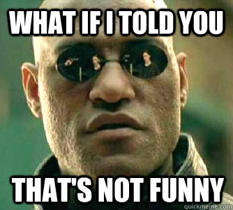

# Medical-Device-Regulation
Medical Device Regulation (MDR)

## Resources
- [RÈGLEMENT (UE) 2017/.... DU PARLEMENT EUROPÉEN ET DU CONSEIL du 5 avril 2017 relatif aux dispositifs médicaux](http://www.qualitiso.com/reglement-europeen-dispositifs-medicaux/main.html)

- [Is my software in class I, IIa, IIb or III? - 2016 Revolution](http://blog.cm-dm.com/post/2016/07/22/Is-my-software-in-class-I%2C-IIa%2C-IIb-or-III-2016-Revolution)

## DM
- [Un logiciel est un dispositif médical comme un autre](http://www.qualitiso.com/applis-logiciel-reglement-dispositifs-medicaux/)
